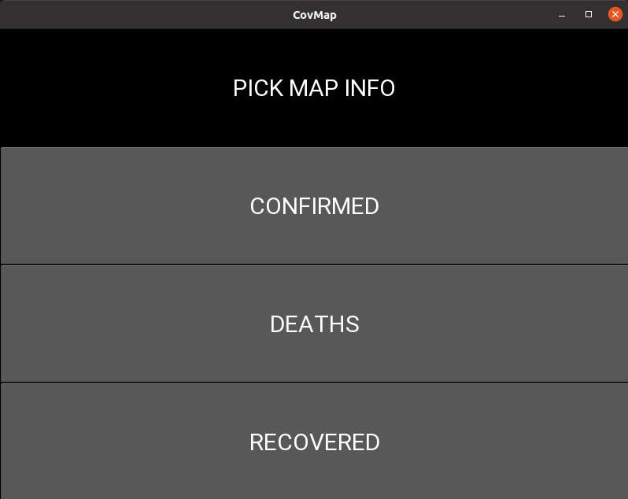
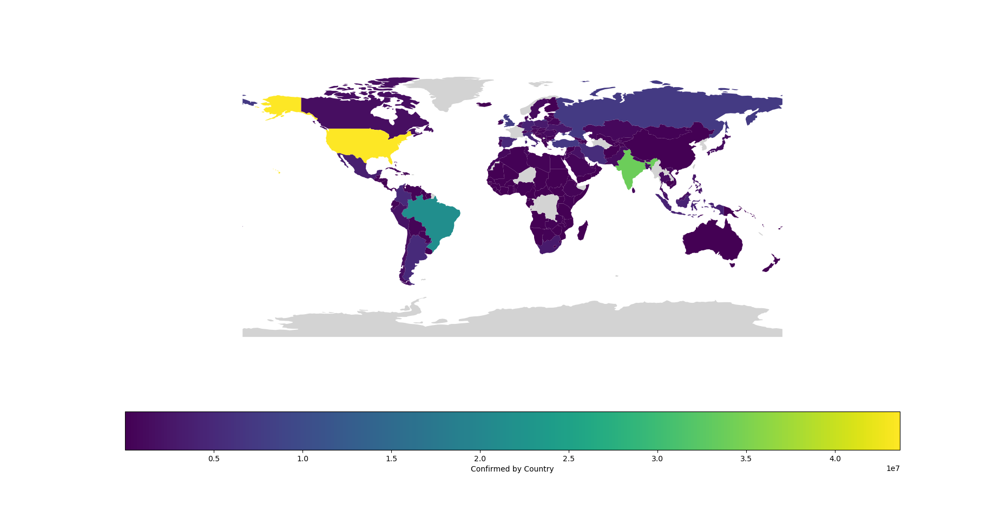

# Covid_Map_Last_day_only

## The program was created to learn how to use data frames, how to make choropleth manualy using matplotlib. GUI is written with "request \ response" method where backend and frontend are in separate files.

## `matplotlib.pyplot`, `pandas`, `geopandas`,`pycountry`, `kivy`

### The program starts with simple Python GUI made in Kivy library with .kv file which is stuff like CSS.

### After choosing which data you need, a choropleth map will be generated. I may take some time.

### The map is created from the latest covid data available on the website: https://raw.githubusercontent.com/datasets/covid-19/master/data/countries-aggregated.csv

### This is only a map, you cannot view country information.

### there are some errors in dataframe: after 14/12/20 US Recovery data disappears and the rest of it around August 2021.
